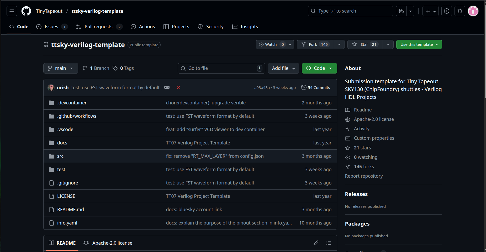
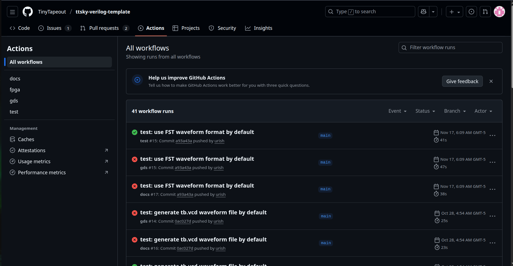
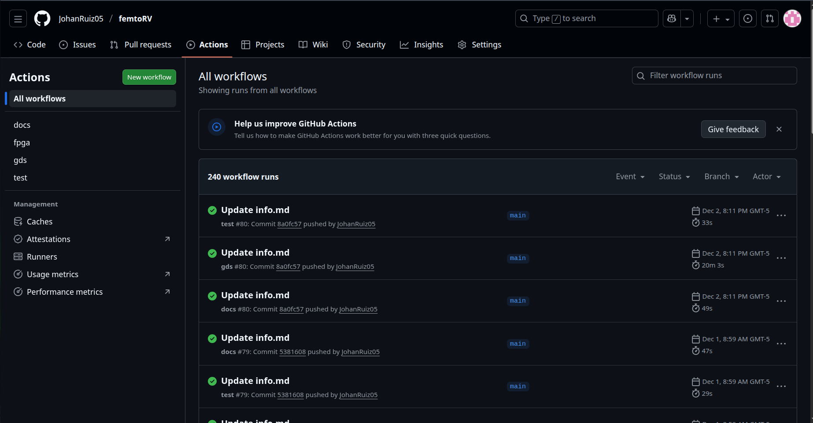
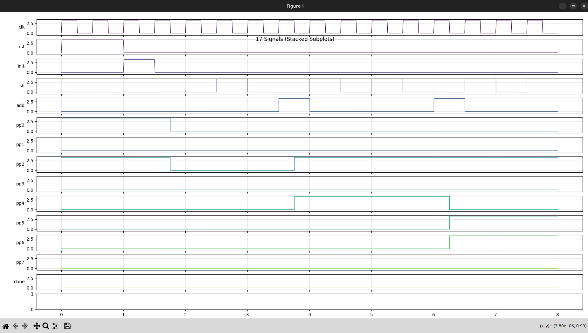
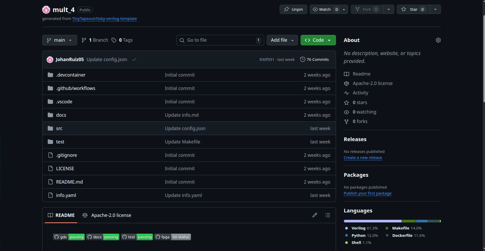
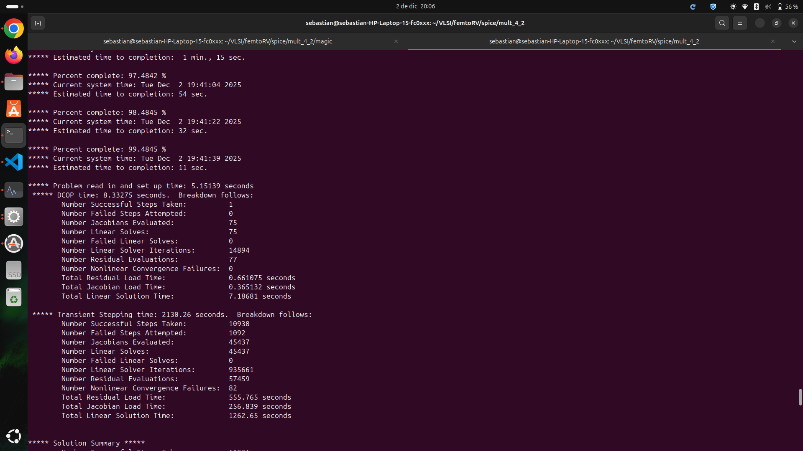
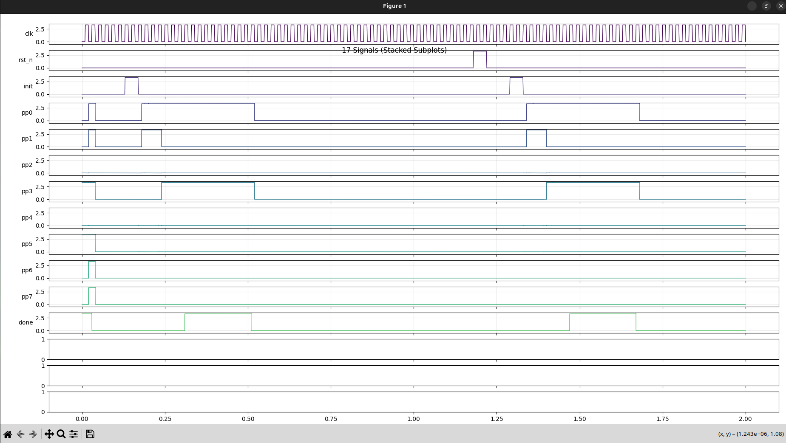

# Implementación de FemtoRV y Tiny Tapeout

A continuación se realiza una descripción del procedimiento llevado a cabo para la implementación del procesador RISC-V FemtoRV, basado en el desarrollo de Bruno Levy, a través de herramientas de diseño VLSI libres y open-source para su posterior envío al proyecto educativo Tiny Tapeout, que permite manufacturar un chip real a partir del desarrollo realizado. Por limitaciones asociadas a la complejidad de la simulación con Xyce y Ngspice del procesador, también se describe la repetición del procedimiento para un circuito de menor complejidad, un multiplicador de 4 bits, que demuestra que el flujo de trabajo es correcto y genera los resultados esperados. El diagrama de bloques del procesador propuesto se observa a continuación.


Para cumplir con el objetivo, se siguió el flujo de diseño VLSI, que comienza con el diseño de la arquitectura (ya desarrollada) hasta alcanzar el diseño físico, basado en la simulación del circuito. Para esto, se usaba la descripción RTL y la síntesis lógica para llegar a nivel de compuertas, las cuáles se simulaban con el objetivo de verificar el funcionamiento. Una vez concluido lo anterior, se procedió a la fabricación del chip diseñado, por medio de Tiny Tapeout. El proceso se observa a continuación.


## Descripción general

El procesador FemtoRV fue implementado inicialmente usando el lenguaje de descripción de hardware (HDL) Verilog, basado en un diseño por módulos lógicos controlados por un archivo top. El módulo principal (top) es femto.v, que instancia la memoria y los diferentes periféricos requeridos para el procesador. La memoria usaba la interfaz SPI (Serial Peripheral Interface) para la comunicación y contaba tanto con una memoria flash para el sistema (mappedSPIFlash.v), como una memoria RAM para el funcionamiento activo del procesador (mappedSPIRAM.v); mientras que como periférico se estableció la UART, necesaria para verificar la correcta ejecución de las diferentes tareas en el procesador (uart.v). Adicionalmente, se tenían periféricos de prueba como el multiplicador, divisor, entre otros, que no fueron utilizados para disminuir el tamaño y complejidad del sistema. Los archivos fuente en Verilog de la implementación se pueden encontrar en la carpeta [OpenLane/src](../src). 

Para ver el flujo de diseño original, se puede consultar el git [VLSI](https://github.com/cicamargoba/VLSI.git). Este contiene los archivos originales generados durante el diseño inicial, permitiendo analizar sus componentes, entradas, salidas y lógica de implementación. 

## Herramientas de diseño y simulación

### Flujo ASIC

Para la instalación de herramientas de flujo ASIC se puede seguir el README disponible en [README](https://github.com/cicamargoba/VLSI/blob/main/README.md), donde se incluye:

1. Yosys             -> Framework para Síntesis Verilog-RTL
2. Icarus Verilog    -> COmpilador de Verilog para generar netlists 
3. GTKWave           -> Visualizador de formas de onda (waveforms) compatible con formatos como VCD
4. NGSpice           -> Simulador SPICE para circuitos analógicos, digitales y mixtos
5. OpenSTA           -> Verificador de timing estático (STA) para gates
6. Magic             -> Herramienta de EDA para diseño basado en VLSI
7. OpenLane          -> Flujo automatizado que abarca desde RTL hasta GDSII, integrando herramientas como OpenROAD, Yosys, Magic, Netgen, KLayout, entre otras.
8. Docker            -> Algunas partes del flujo de trabajo lo requieren

### Diseño de circuito y físico

Además de las herramientas propias del flujo ASIC, fue necesario instalar dos herramientas para el diseño físico y de circuito, correspondientes a OpenPDK, que habilita el uso de Sky130 para el diseño de circuitos integrados (y que es usado por Tiny Tapeout); y Xyce, un simulador de circuitos analógicos de alto rendimiento. Los comandos para su instalación se muestran a continuación.

9. OpenPDK

```bash
git clone git://opencircuitdesign.com/open_pdks
cd open_pdks
./configure --enable-sky130-pdk 
make
sudo make install
```

10. Xyce

```bash
git clone https://github.com/ChipFlow/Xyce-build.git
cd Xyce-build/
./build.sh 
sudo make install prefix=/usr/local
```

Los archivos de instalación de OpenPDK pueden no ser leídos al ejecutar Xyce por guardarse con un nombre diferente en la carpeta de origen. Para evitarlo, se puede renombrar la carpeta creada como /.volare (convirtiéndolo una carpeta oculta), lo que permitirá que los procesos que lo requieran apunten correctamente a las herramientas instaladas.

## Flujo de trabajo

### 1. Compilación

La verificación inicial del diseño en Verilog a partir de los archivos fuente se realizó por medio de Icarus Verilog, un compilador de código abierto usado para verificar el diseño de circuitos digitales antes de la implementación. Para su uso, se debe contar con un archivo Testbench, donde se generan señales de prueba que actúan como entradas para el módulo principal (femto) con el objetivo de verificar el correcto funcionamiento del diseño realizado. El comando general para la compilación con iverilog es:

```bash
iverilog -DFUNCTIONAL (TARGET)_TB.v (OBJS)
```

Donde TARGET hace referencia al nombre del Testbench de prueba y OBJS es una estructura donde se pueden agrupar los diferentes archivos fuente del diseño. El resultado de este procedimiento es un archivo ejecutable llamado a.out por defecto (con compiladores gcc como es el caso), que convierte los datos de salida en señales que pueden ser observadas con programas como GTKWave. La simulación del archivo se hace con el comando:

```bash
vvp a.out
```

El cual genera un archivo VCD (.vcd) que contiene las señales asociadas a las entradas, salidas y señales intermedias del diseño. Para su visualización y análisis se usó GTKWave, donde se pueden ubicar las diferentes señales de interés en un panel de formas de onda, además de guardar archivos de escritura .gtkw para mantener las trazas necesarias ante cambios o correciones. Adicionalmente, es posible realizar este proceso a partir del firmware (archivos .hex), con archivos como los que se encuentran en la carpeta principal de este repositorio, pero no se usó para los ejemplos posteriores.

### 2. Síntesis y flujo de diseño ASIC

Para pasar del diseño digital RTL descrito al diseño de chips ASIC, se usó la herramienta de código abierto OpenLane, que permite llegar a los resultados de implementación física para fabricación con varias etapas de procesamiento intermedias. El objetivo de este paso era asegurar que el diseño fuera adecuado a nivel de circuito real (basado en transistores) antes del paso de envío a Tiny Tapeout.

OpenLane toma los archivos disponibles en la carpeta [OpenLane](/OpenLane) y automatiza el flujo de diseño en cinco etapas:

1. Síntesis: Convierte el código de Verilog en una netlist de compuertas lógicas por medio de la herramienta Yosys.
2. Floorplan: Hace un plano de circuito a nivel de compuertas lógicas.
3. Placement: Ubica cada bloque de circuito sobre el chip.
4. Routing: Conecta cada compuerta y bloque de manera física dentro del chip, respetando las restricciones de tiempo y área.
5. Timing Analysis: Comprueba que las señales cumplan con tiempos, evitando errores de sincronización. 

El ejemplo de salida para femto se puede ver en la carpeta del mismo nombre dentro de [OpenLane](/OpenLane/femto). La ejecución, sin embargo, debe realizarse desde la carpeta local de OpenLane (donde se descargó originalmente la herramienta), ya que esta contiene todos los archivos necesarios para poder realizar el proceso. De esta manera, el resultado se guardó en en la carpeta llamada /OpenLane/designs/<nombre diseño>/runs/full_guide/results, donde el nombre se define explícitamente en el comando:

```bash
make mount
./flow.tcl -design <design name> -init_design_config -add_to_designs 
```

En el ejemplo, se usó como nombre de diseño femto. El segundo comando solo debe ser ejecutado la primera vez que se genera un run, en pruebas posteriores se puede cambiar para evitar la creación de múltiples subejecuciones de nombre similar en la carpeta, activando el parámetro overwrite para sobreescribir el resultado anterior y mantener el orden. 

```bash
./flow.tcl -design <design name> -tag full_guide -overwrite 
```

En la carpeta /results se tienen los resultados para cada uno de las etapas de diseño, además de una carpeta llamada [final](/OpenLane/femto/runs/full_guide/results) con los archivos más relevantes para los pasos posteriores, incluyendo la salida de cada una de las etapas y el resultado del chip físico implementado en la carpeta /final. 

### 3. Manejo de Magic

Entre los archivos de salida en [results](/OpenLane/femto/runs/full_guide/results), resulta importante el .mag que contiene la carpeta /final, que corresponde al diagrama de compuertas del place and route en Magic, a partir de la herramienta Sky130. Magic sirve como editor y visor del layout físico del circuito integrado sintetizado, mostrando las diferentes capas, polígonos y rutas construidas. Al ser una representación física no se puede usar para simulación, por lo que es necesario convertirla al formato SPICE por medio de la opción de extracción de esta herramienta, obteniendo un netlist completo que representa el chip físico a través de transistores NMOS y PMOS y las conexiones entre capas, realizando los siguientes comandos en la terminal de Magic:

```bash
gds noduplicates
gds readonly true
extract do local
extract all
```

Este proceso extrae todo lo que contiene el layout en un archivo .ext, incluyendo las capacitancias parásitas y resistencias adicionales, lo que puede generar archivos de gran tamaño de muy alta complejidad para la simulación. Para evitar esto, el proceso debe culminarse añadiendo parámetros a la conversión del archivo .ext a .spice:

```bash
ext2spice lvs
ext2spice cthresh infinite
ext2spice rthresh infinite
ext2spice subcircuit off
ext2spice hierarchy off
ext2spice scale off
ext2spice
```

El resultado, por lo tanto, es un archivo .spice que puede ser usado para la simulación del diseño con Xyce o NGSpice, ubicándolo en la carpeta principal del proyecto.

### 4. Simulación de SPICE

Para este paso, inicialmente se creó una única carpeta que contuviera todos los resultados de los pasos anteriores, lo que permitió realizar la simulación del circuito extraido con Magic. Es importante mencionar que el flujo requiere varios archivos de sky_130 para funcionar, por lo que es necesario que estén incluidos en la carpeta de origen o que se apunte a ellos en caso de usar un Makefile. Estos son:

- sky130_fd_sc_hd.v
- primitives.v

Una vez comprobado que se tienen todos los archivos necesarios, se debe abrir la simulación de GTKWave realizada previamente y ubicar en el visor de formas de onda el clk, el rst y todas las demás señales de entrada relevantes del diseño, lo que permitirá obtener los valores de flancos de subida y bajada necesarios para la comprobación con el archivo .spice. Una vez definidas, se debe seleccionar en el menú superior de la aplicación la opción File -> Export -> Write TIM File as, lo que genera un archivo de temporización .tim que guarda los tiempos de propagación de las señales seleccionadas y las rutas de temporización en el circuito. Se recomienda que el nombre del archivo .tim sea el mismo del diseño principal. Un ejemplo se puede ver en la siguiente figura.


El archivo .tim posibilita generar un netlist de SPICE con las señales seleccionadas como entradas del circuito en SPICE para la simulación final por medio de Xyce o Ngspice. La integración de los archivos .tim y .spice se realiza en un archivo .cir, formato que requieren las dos herramientas mencionadas para el procesamiento, donse se instancia tanto la temporización de las señales como la representación edel circuito. Para realizar la conversión de .tim a .cir se usó un script de Python llamado [tim_to_pwl.py](spice/tim_to_pwl) que se encargaba de traducir los datos al formato necesario en el .cir (señales PWL o DC y simulación transient) sin alterar los nombres de las señales. El parámetro editable más relevante del script es epsilon, ya que define el tiempo de cambio del flanco de las señales. Tiempos muy cortos (inferiores a 1e-09) ocasionaban errores en Xyce, por lo que se eligió este valor para asegurar el funcionamiento. El comando para ejecutar el script es:

```bash
python3 ../tim_to_pwl.py <tim filename>
```

Asumiendo que el script está una carpeta antes de la que contiene los archivos del diseño realizado (../). La ejecución del script genera un archivo .cir del mismo nombre con las características descritas, así como definiciones del tiempo de simulación (.tran), que aumenta o reduce los recursos necesarios para la simulación, el llamado a las librerías SPICE de sky130 y el include del archivo .spice. Completando este paso y estando ubicado en la carpeta del diseño, se tienen dos opciones para la simulación:

* Con Xyce

```bash
mpirun -np <num. procesos> Xyce <netlist filename>
```

* Con NGSpice

```bash
ngspice <netlist filename>
```

Donde Xyce es un simulador de alta capacidad con paralelización, contando con el parámetro <num. procesos> para definir el número de hilos de simulación, útil para circuitos muy grandes, mientras que Ngspice únicamente soporta un hilo de ejecución y puede ser más lenta, pero tiene la ventaja de consumir menos recursos del procesador durante su ejecución. La duración del proceso depende de la complejidad del circuito, la cantidad de señales instanciadas y el tamaño del archivo .spice.

Cuando finaliza la simulación con alguna de las herramientas se genera como salida un archivo .raw, que es una representación numérica completa de los datos de salida sin procesar. Este formato puede ser leído por medio de LTSpice y un visor gráfico, para lo cual se generó un nuevo script de Python (plot.py) que tomaba el .raw (por medio de la variable filepath) y lo graficaba, con:

```bash
python3 plot.py
```

En algunas distribuciones de Linux no es posible instalar LTSpice como aplicación, por lo que es necesario crear un entorno de Python para poder graficar el resultado. Los comandos para este fin son:

```bash
python3 -m venv <env name> #Solo se ejecuta una vez para crear el entorno, si ya existe se omite
source <env name>/bin/activate
pip install ltspice #Solo se ejecuta una vez para instalar LTSpice, si ya se realizó se omite
```

Concluyendo así la verificación del diseño realizado a partir de la simulación del circuito físico resultante y su comparación con los resultados mostrados en el primer paso (compilación). 

### 5. Integración con Tiny Tapeout

Para enviar un diseño a Tiny Tapeout es necesario realizar una serie de cambios al código de origen para adaptarlo a los requerimientos de la plataforma, obligatorios para su aceptación. El flujo de trabajo se ejecutaba de manera automática desde Github, usando herramientas muy similares a las descritas hasta este paso. La plantilla usada para un diseño con sky se encuentra en [Tiny Tapeout](https://github.com/TinyTapeout/ttsky-verilog-template), donde se indican también los pasos necesarios para participar en el proyecto; por lo que se hizo una copia y se trabajó sobre ella. 



En los archivos fuente (src) de Verilog únicamente debía adaptarse el módulo top del diseño, siguiendo la plantilla del archivo [project.v](https://github.com/TinyTapeout/ttsky-verilog-template/blob/main/src/project.v) que define todos los pines mandatorios que contienen los diseños de Tiny Tapeout. Es importante ser cuidadoso con la asignación de pines para no cometer errores o modificar el comportamiento del diseño, además de indicar los pines que no se usan en el diseño y conectarlos a tierra. Los parámetros de la simulación se definían en el archivo [info.yaml](https://github.com/TinyTapeout/ttsky-verilog-template/blob/main/info.yaml), donde se indicaban los archivos fuente del diseño, los pines usados (en el mismo orden que en el archivo top) y el tamaño del ASIC (tiles). Tiny Tapeout ofrece 8 pines de entrada, 8 de salida y 8 adicionales inout por si se requieren en el diseño. Adicionalmente, se debía diligenciar el archivo [info.md](https://github.com/TinyTapeout/ttsky-verilog-template/blob/main/docs/info.md) en la carpeta /docs con información del proyecto. 

El flujo de trabajo tiene tres partes:

1. gds: Síntesis y flujo de diseño ASIC.
2. docs: Información del proyecto en el archivo info.md.
3. test: Simulación del diseño con la herramienta CocoTB, basada en Python.

Mencionando que CocoTB es un framework basado en Python para verificar diseños en HDL. Durante el desarrollo de este proyecto no fue empleado, por lo que solo se adaptó el archivo [test.py](https://github.com/TinyTapeout/ttsky-verilog-template/blob/main/test/test.py) para evitar errores y se comentó la función assert (verificar que la salida sea igual a), haciendo lo mismo con el archivo [tb.v](https://github.com/TinyTapeout/ttsky-verilog-template/blob/main/test/tb.v) para el diseño. Para asegurar el éxito de esta parte, se llamaron los archivos fuente en el [Makefile](https://github.com/TinyTapeout/ttsky-verilog-template/blob/main/test/Makefile).

Cada cambio realizado activa de manera automática una nueva ejecución del flujo de trabajo gracias a la configuración de [Github Actions](https://github.com/TinyTapeout/ttsky-verilog-template/actions) de la plantilla, lo que permite ir verificando cada uno de los pasos y corrigiendo los posibles errores que se generen. En la pestaña de Github Actions aparece cada workflow run, por lo que haciendo click sobre alguna de las partes se puede acceder a la información detallada del proceso, errores y resultados finales. Es importante mencionar que el proceso gds, al ser el flujo de trabajo completo, puede tardar varios minutos en ejecutarse.



### 6. Simulación de  resultados de Tiny Tapeout

Una vez que todas las partes del flujo son aprobadas, es posible verificar los resultados desde Github Actions. En la parte izquierda aparece un menú de los diferentes workflows ejecutados, donde se debe elegir gds y luego la última ejecución exitosa. En la imagen se ve un ejemplo de visualización de esta pestaña en la plantilla original (fallida).


Así, se abre el resumen del proceso realizado (gds summary), el cual se puede consultar para mayor información del uso de recursos físicos del diseño respecto al tamaño del chip seleccionado (uso de celdas, utilización de tutas, warnings, procesos de precheck, entre otros). La última sección (parte inferior de la página), llamada Artifacts, contiene los resultados finales de gds, permitiendo su descarga en un archivo comprimido llamado tt_submissions, que resulta útil para verificar el procedimiento realizado.

Dentro de la carpeta creada al descomprimir tt_submissions se encuentran los archivos propios de tinytapeout y una subcarpeta del mismo nombre que contiene los resultados del flujo de trabajo ejecutado con Tiny Tapeout, destacando el archivo de Verilog sintetizado (.v) y la implementación física del circuito (.gds). El último tiene una estructura similar al archivo .mag usado durante el paso 2, por lo que puede ser usado para obtener un modelo SPICE de salida y repetir los pasos de la sección Manejo de Magic. Para abrir el archivo .gds en Magic se debe ejecutar:

```bash
export PDK_ROOT=/usr/local/share/pdk/
export PDK=sky130A
magic -T $PDK_ROOT/sky130A/libs.tech/magic/sky130A.tech tt_um_femto.gds
```

Con el resultado, se repiten los pasos indicados en la sección Simulación de SPICE de manera local. De esta manera, se puede comprobar que el diseño enviado a Tiny Tapeout es correcto y genera los mismos resultados que la ejecución local del flujo de trabajo, a partir de los archivos de salida. Es importante tener en cuenta que es posible usar la simulación ya generada con GTKWave para obtener el .tim, pero al convertirlo al archivo .cir es necesario cambiar los nombres de las señales a los nombres dados en los archivos de Tiny Tapeout (ui_in[7:0], uo_out[7:0], entre otros), de tal manera que concuerden con el archivo . spice generado. De la misma manera, las señales deben ser llamadas de la misma forma en el archivo plot.py para que sean graficadas correctamente, asignando el path correcto al archivo .raw generado. Así, se concluye el procedimiento realizado.

## Aplicación

### Procesador FemtoRV (femto)

Habiendo realizado los primeros tres pasos del flujo de trabajo como fue descrito anteriormente, cuyos resultados se encuentran en la presente carpeta del repositorio, se procedió a realizar la extracción en SPICE del resultado a partir del archivo .mag, recordando que está ubicado en [results](/OpenLane/femto/runs/full_guide/results/final), siguiendo los comandos descritos en la sección Manejo de Magic. El resultado obtenido se ubicó en la carpeta [spice/femto](spice/femto/femto.spice), que contiene todos los archivos de diseño requeridos y resultantes desde este paso.

Teniendo lo anterior, se abrió el archivo de GTKWave y se ubicaron las señales de interés para la simulación en el visor de formas de onda. Para femto se tenían cuatro señales necesarias: clk (clock del sistema), resetn (reset del sistema), spi_miso y spi_miso_ram (interfaces master input slave output). Una vez definidas, se exporta el archivo TIM y se le da como nombre [femto.tim](spice/femto/femto.tim).

El resultado, como fue descrito, es un archivo .tim a partir del cual se puede generar el archivo .cir que recibe como entrada Ngspice o Xyce, y que contiene una representación temporal de las señales a simular, a través de flancos digitales de subida y bajada entre 0 (0 V) y 1 (3.3 V). Para la conversión usó el script de Python tim_to_pwl.py, disponible en la carpeta [/spice](/spice/tim_to_pwl.py) para su uso en otros diseños, cuya ejecución generó un .cir del mismo nombre [femto.cir](/spice/femto/femto.cir) con las señales exportadas de GTKWave. El resultado se ve a continuación, donde se destacan como parámetros importantes el tiempo de simulación (.tran), que aumenta o reduce los recursos necesarios para la simulación, el llamado a las librerías SPICE de sky130 y el include del archivo .spice generado en el anterior paso.


Para ejecutar la simulación, se usó tanto Xyce como Ngspice, pero la complejidad del circuito de salida impidió obtener el resultado esperado, ya que se requería una alta capacidad de memoria RAM para el procesamiento. Esto se debía al tamaño y complejidad del SPICE generado, que pese a no tener resistencias ni capacitancias parásitas tenía un gran número de rutas que dificultaban su ejecución. Sin embargo, para continuar con el desarrollo, se procedió a la integración del desarrollo con Tiny Tapeout. 

Para este fin, fue necesario realizar una serie de cambios al código de origen para adaptarlo a los requerimientos de la plataforma, necesarios para su aceptación. El flujo de trabajo era automático desde Github, usando herramientas muy similares a las descritas en la sección FLujo de trabajo. El repositorio usado para este fin, clonado a partir de la plantilla de Tiny Tapeout para Sky130, se encuentra en el siguiente [link](https://github.com/JohanRuiz05/femtoRV).

En los archivos de Verilog de origen únicamente se debía adaptar el módulo top, femto.v. El módulo final se puede ver en la carpeta  [/src](https://github.com/JohanRuiz05/femtoRV/blob/main/src/femto.v) del repositorio. Adicionalmente, se debían establecer explícitamente los parámetros de funcionamiento, archivos source y pines de entrada y salida en el archivo [info.yaml](https://github.com/JohanRuiz05/femtoRV/blob/main/info.yaml), así como diligenciar la información requerida en el archivo [info.md]([../docs/info.md](https://github.com/JohanRuiz05/femtoRV/blob/main/docs/info.md)) dentro de la carpeta /docs. Con este procedimiento, y corrigiendo diferentes errores asociados principalmente a la sintaxis exigida por Tiny Tapeout, se completó el flujo de trabajo exigido para la recepción del trabajo. El más relevante de los resultados es gds, ya que describe el mismo flujo de trabajo realizado de manera local y, por ende, brinda los resultados necesarios para las siguientes etapas.

Por otra parte, se hizo la adaptación del testbench de diseño, actualizando los archivos de la carpeta /test [tb.v](https://github.com/JohanRuiz05/femtoRV/blob/main/test/tb.v) con las señales del módulo top en Verilog; [test.py](https://github.com/JohanRuiz05/femtoRV/blob/main/test/test.py) con la instanciación de las señales para CocoTB y [Makefile](https://github.com/JohanRuiz05/femtoRV/blob/main/test/Makefile) llamando a los diferentes módulos de Verilog necesarios para el funcionamiento del proyecto. Se debe mencionar que se comentó la función assert dentro del script de python test.py, de tal manera que no se hiciera una verificación del diseño con esta herramienta, sino que se probaran los resultados de forma local. Para este objetivo, se pueden seguir los pasos descritos en el [README](https://github.com/JohanRuiz05/femtoRV/blob/main/test/README.md) de la plantilla.

La ejecución del proceso se puede ver en la sección Actions del repositorio, que brinda toda la información relevante y detallada de cada proceso, errores en caso de que se presenten y los resultados, tardando aproximadamente media hora en concluir (por acción de gds).

Una vez que concluyeronn las tres acciones y todas fueron aceptadas, se remitió a Github Actions buscando verificar los resultados. En la parte izquierda aparece un menú de los diferentes workflows ejecutados, donde se debe seleccionar gds al corresponder a los resultados de síntesis del proyecto, como se observa a continuación.



Seleccionando la última ejecución exitosa, se abre el resumen del proceso realizado (gds summary), el cual se puede consultar para mayor información del uso de recursos para las condiciones establecidas de diseño (uso de celdas, utilización de tutas, warnings, procesos de precheck, entre otros). La última sección, llamada Artifacts, contiene los resultados finales, permitiendo su descarga para el análisis. La simulación se realizó con la carpeta de salida tt_submission, como se puede ver.


La carpeta descargada, que puede ser consultada en el presente repositorio en la carpeta [/tt_um_femto](/spice/tt_um_femto/tt_submission), debe ser descomprimida por estar en formato .zip, y contiene los archivos src del diseño, así como una subcarpeta llamada tt_submission, donde se encuentra:

- tt_um_femto.gds
- tt_um_femto.lef
- tt_um_femto.spef (max, min y nom)
- tt_um_femto.oas
- tt_um_femto.v

A partir de los cuales es posible obtener el archivo .spice recordando los comandos descritos para la extracción de Magic (Manejo de Magic) por medio del archivo tt_um_femto.gds. EL comando para abrir Magic sobre este archivo es:

```bash
export PDK_ROOT=/usr/local/share/pdk/
export PDK=sky130A
magic -T $PDK_ROOT/sky130A/libs.tech/magic/sky130A.tech tt_um_femto.gds
```

Posteriormente, se configuró la extracción solo de dispositivos (sin parásitos), siguiendo los pasos de la sección de Manejo de Magic. El archivo resultante permite repetir los pasos descritos durante la simulación del diseño, ubicando todos los archivos de salida en la carpeta [tt_um_femto](spice/tt_um_femto). Los archivos .ext generados durante la extracción, salvo por tt_um_femto.ext (sobre el que se aplica ext2spice), no fueron usados. 

Con lo anterior, basta regresar al archivo .tim generado a partir de la traza [tt_um_femto_sim_1.gtk](spice/tt_um_femto/tt_um_femto_sim_1.gtk), que se observa a continuación, para su conversión a un nuevo .cir.


El resultado se llamó [tt_um_femto_TB.cir](/spice/tt_um_femto/tt_um_femto_TB.cir), y en este se cambiaron los nombres de las señales (acorde con los cambios realizados para Tiny Tapeout) y se añadió el .spice directamente para no hacer uso de include. Los pasos siguientes (con Xyce o Ngspice) no pudieron ser realizados de nuevo por la complejidad del circuito extraído, lo que impidió una simulación a nivel físico de la implementación de femto, si bien todos los resultados del proceso y archivos necesarios para replicar el procedimiento se encuentran en la carpeta [/tt_um_femto](/spice/tt_um_femto). Para comprobar que las etapas del flujo de trabajo se habían implementado de manera correcta, se repitió el proceso completo para un diseño ya comprobado de menor complejidad, un multiplicador de 4 bits, como se describe en la siguiente sección.

### Multiplicador de 4 bits (mult_4)

La aplicación del flujo de trabajo descrito se realizó con un multiplicador de 4 bits, con dos entradas A y B de 4 bits, salida PP de 8 bits y señales de init y done, al estar basados en una máquina de estados. Los archivos fuente se pueden encontrar en la carpeta /src dentro de [mult_4](/spice/mult_4/src). Un esquemático del diseño para entender su funcionamiento se ve a continuación, recordando que en este caso se manejan 4 bits en vez de 32 bits (como indica el esquemático):


Sobre esta misma carpeta se puede encontrar el archivo Testbench usado para la simulación lógica con iverilog del multiplicador [mult_4_TB](/spice/mult_4/src/mult_4_TB.v). Para simplificar el proceso, se creó un [Makefile](/spice/mult_4/Makefile) con los comandos indicados en la sección Compilación indicando el path a los demás archivos fuente, simplificando todo el proceso al comando:

```bash
make sim
```

Así, es posible ver el ejecutable a.out y la salida Mult_4_TB.vcd en la misa carpeta, con lo que se comprobó el correcto funcionamiento del multiplicador implementado. Se establecieron como entradas A = 3 y B = 3, por lo que PP debía ser PP = 9, como se puede ver a continuación en GTKWave. El archivo de formas de onda, además, se guardó (.gtkw) para los pasos posteriores. 


Evidenciando que las señales siguen el flujo indicado en mult_4.v, con una señal de reset que indica al init la activación de la operación, la recepción de las entradas A y B y el procedimiento matemático de suma y corrimiento necesario (control_mult.v) para obtener el resultado correcto. Luego de que la salida PP muestra el resultado esperado (9), se activa la señal de done, indicando el fin de la operación. La traza se exportó a .tim, siguiendo los pasos ya descritos.

Teniendo el resultado anterior, se procedió a realizar síntesis y flujo de diseño ASIC con OpenLane, obteniendo el archivo .mag a partir del cual se construye el .spice siguiendo los pasos de exportación de la sección Manejo de Magic. El archivo se puede encontrar en [mult_4](/spice/mult_4/Mult_4.spice). Este proceso tarda varios minutos a pesar de que el diseño no es muy complejo, pero no requiere gran capacidad de memoria RAM, y los archivos relevantes para los demás pasos del proceso se ubicaron en la carpeta /mult_4.

Tras esto, se obtiene el archivo .tim a partir de la traza [Mult_4_TB.gtkw](/spice/mult_4/Mult_4_TB.gtkw), y se procede a realizar la conversión a .cir usando el archivo [tim_to_pwl.py](/spice/tim_to_pwl.py), ubicado en la carpeta /spice general para su uso en todos los diseños. En esta carpeta también se puede encontrar la subcarpeta [verilog_model](/spice/verilog_model), donde están los archivos primitivos de sky_130 para evitar errores y que son llamados desde el Makefile. El archivo resultante se puede consultar es [Mult_4_TB.cir](/spice/mult_4/Mult_4_TB.cir), donde se puede destacar la instanciación de la librería de sky130 por medio de un path general, lo que es obligatorio para el funcionamiento de la simulación, así como el tiempo de simulación (hasta 80 us para reducir el tiempo). En este caso, para facilitar el proceso, se copió y pegó el contenido del archivo .spice directamente en el archivo .cir, evitando problemas de lectura que suele tener el uso de .include. 

Dentro del Makefile también se definió el comando que se muestra a continuación, que incluía la ejecución con Xyce de la simulación del circuito y la elaboración de la gráfica de salida con el archivo [plot_Mult_4.py](/spice/mult_4/plot_Mult_4.py). 

```bash
make xyce
```

Donde se debe destacar que el archivo plot_Mult_4.py toma los voltajes instanciados de acuerdo con los nombres dados en el archivo .cir, por lo que errores relacionados con la ejecución del script pueden deberse a nombres inexistentes o voltajes sin asignación de señal. El resultado se observa a continuación, añadiendo las señales sh y add como verificación del control de la máquina de estados.



Habiendo verificado los resultados del flujo de trabajo ASIC, es posible proceder a la integración con Tiny Tapeout, creando una copia de la plantilla en Github y renombrándola como mult_4. Para su consulta, se puede acceder al siguiente [link](https://github.com/JohanRuiz05/mult_4).

En mult_4 se hicieron los cambios necesarios para que la ejecución de Github Actions fuera correcta. Los archivos de origen se ubicaron en la carpeta [src](https://github.com/JohanRuiz05/mult_4/tree/main/src) y se diligenció el archivo [info.md](https://github.com/JohanRuiz05/mult_4/blob/main/docs/info.md) para comenzar las correciones de sintaxis requeridas. Como fue descrito, el único archivo fuente que se debe cambiar es el top, [mult_4.v](https://github.com/JohanRuiz05/mult_4/blob/main/src/mult_4.v), siguiendo la plantilla de project.v propuesta por Tiny Tapeout y adaptando las asignaciones de pines para mantener la misma lógica de funcionamiento. Al ser un diseño pequeño, no se presentaron errores importantes de sintaxis.

Posteriormente, se actualizó el archivo [info.yaml](https://github.com/JohanRuiz05/mult_4/blob/main/info.yaml), indicando los archivos fuente, definiendo un tamaño de chip de 2X2 tiles y ubicando los pines tal y como fueron asignados en mult_4.v. Como el diseño requiere 8 pines para las dos entradas y 8 pines de salida, se usaron dos pines inout para init (uio_in) y done (uio_out), completando los requerimientos del diseño. 

Finalmente, en la carpeta test se modificaron los archivos [Makefile](https://github.com/JohanRuiz05/mult_4/blob/main/test/Makefile), [tb.v](https://github.com/JohanRuiz05/mult_4/blob/main/test/tb.v) y [test.py](https://github.com/JohanRuiz05/mult_4/blob/main/test/test.py) como fue descrito en la Sección Integración con Tiny Tapeout, asegurando que las tres partes del flujo de trabajo fueran exitosas, como se ve a continuación.



Así, se descargaron los resultados desde Github Actions, seleccionando la última ejecución exitosa de gds (flujo de diseño ASIC). Se debe recordar que el archivo de interés es tt_submission, que contiene lo necesario para la simulación de resultads de Tiny Tapeout. 


La carpeta de salida de Tiny Tapeout se añadió al presente repositorio, y se puede encontrar en [tt_um_mult_4](spice/tt_um_mult_4/tt_submission). Los demás archivos corresponden a los resultados más relevantes del proceso para los pasos posteriores, salvo por tt_um_mult_4_TB, que es el mismo testbench original pero adaptado para funcionar con tt_um_mult_4.v. Así, se exportó con Magic el archivo tt_um_mult_4.gds, disponible en [/tt_submission](spice/tt_um_mult_4/tt_submission/tt_submission), para obtener el archivo .spice, como se ve a continuación.


Luego, se convirtió el archivo .tim que había sido generado en el primer paso a partir de la traza .gtkw a .cir con tim_to_pwl.py, y se cambiaron los nombres de las señales generadas para que concordaran con las de Tiny Tapeout (recordando las definiciones en info.yaml), de tal manera que el circuito recibiera las entradas correctamente. Adicionalmente, se redujo el tiempo de simulación a 2us (reduciendo complejidad de simulación y concordando con el .tim) y se copió el contenido del archivo .spice. El archivo .cir se encuentra en [/tt_mult_4](spice/tt_um_mult_4/tt_um_mult_4.cir) para su análisis; así como el archivo exportado [tt_um_mult_4.spice](spice/tt_um_mult_4/tt_um_mult_4.spice).

Con lo anterior, se ejecutó la simulación en Xyce sobre tt_um_mult_4.cir. Se usaron 8 núcleos para aumentar la eficiencia del procesamiento, y la ejecución tardó aproximadamente 35 minutos en terminar. El resultado se observa en la siguiente imagen.



Finalmente, se modificó el archivo [plot_Mult_4](spice/tt_um_mult_4/plot_Mult_4.py) para que los nombres de las señales concordaran con las de SPICE y que la variable filepath apuntara al .raw generado. El resultado, que muestra el mismo comportamiento que el de la simulación lógica en GTKWave, se ve a continuación. Así, se verifica que el procedimiento realizado fue correcto y el diseño VLSI implementado tanto de manera local (con herramientas open source) como en Tiny Tapeout hace posible el diseño de chips con múltiples propósitos. 



